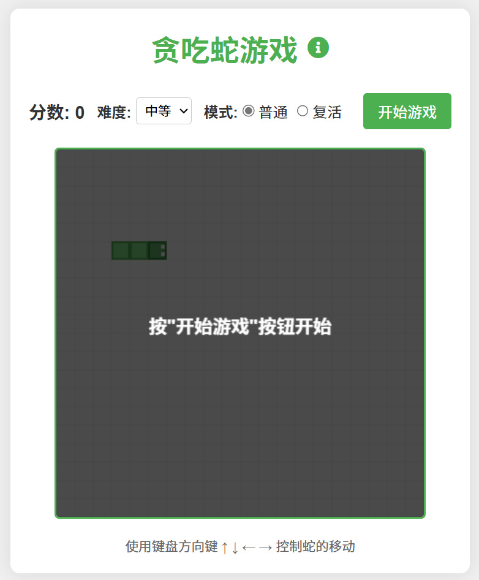

# HTML5贪吃蛇游戏

一个使用HTML5 Canvas、CSS和JavaScript开发的经典贪吃蛇游戏。该游戏支持键盘控制和移动端触摸控制，提供多种难度选择。

## 游戏特点

- 使用HTML5 Canvas实现的流畅游戏体验
- 响应式设计，适配桌面和移动设备
- 移动设备上显示触控方向按钮
- 三种难度等级（简单、中等、困难）
- 实时分数显示
- 游戏结束提示
- 美观的视觉效果（蛇头、身体和食物的设计）

## 系统要求

- 现代浏览器，支持HTML5和Canvas
- 支持JavaScript的浏览器环境
- 移动设备上的触控支持（可选）

## 使用方法

### 安装

1. 下载所有游戏文件（index.html, style.css, script.js）
2. 将文件放在同一目录下
3. 在浏览器中打开index.html文件

### 游戏控制

**桌面设备：**
- ↑（上箭头）：向上移动
- ↓（下箭头）：向下移动
- ←（左箭头）：向左移动
- →（右箭头）：向右移动
- 空格键：开始/重新开始游戏

**移动设备：**
- 屏幕上的方向按钮控制移动方向
- "开始游戏"按钮：开始/重新开始游戏

### 难度设置

游戏提供三种难度级别，影响蛇的移动速度：
- 简单：速度较慢，适合初学者
- 中等（默认）：速度适中，平衡的游戏体验
- 困难：速度较快，挑战性更高

可以在游戏开始前或游戏进行中随时更改难度。

## 游戏规则

1. 使用方向键控制蛇的移动方向
2. 吃到食物（红色圆点）时，蛇身会变长，分数增加
3. 撞到墙壁或自己的身体时游戏结束
4. 尽可能获得更高的分数

## 技术实现

### 文件结构

- `index.html`：游戏的HTML结构
- `style.css`：游戏的样式表
- `script.js`：游戏的JavaScript逻辑

### 技术细节

1. **HTML5 Canvas**：用于绘制游戏画面
2. **响应式设计**：使用CSS媒体查询适配不同设备
3. **游戏循环**：使用setInterval实现游戏主循环
4. **碰撞检测**：检测蛇与食物、墙壁和自身的碰撞
5. **事件监听**：处理键盘事件和触摸事件
6. **难度控制**：通过调整游戏循环的时间间隔改变游戏速度

### 核心算法

- 蛇的移动：使用数组存储蛇的每个部分位置，移动时在头部添加新位置，尾部移除
- 食物生成：随机生成不与蛇身重叠的位置
- 碰撞检测：检查蛇头坐标是否与墙壁或蛇身重叠

## 开发者信息

贪吃蛇游戏由HTML5、CSS3和原生JavaScript开发，无需任何外部依赖或框架。

## 后续改进计划

- 添加本地高分记录
- 增加不同的游戏模式（如穿墙模式）
- 添加游戏音效
- 实现特殊食物和能力道具
- 添加游戏暂停功能
- 实现多人游戏模式